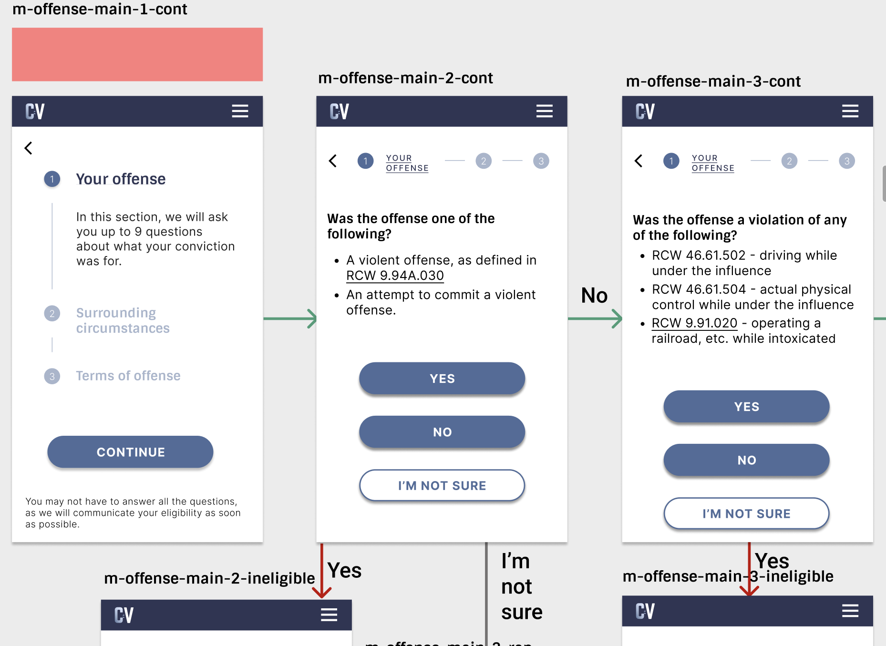

# Clearviction + Sanity Clean Content Studio

## Updating config

1. Update the schema files in `./schemas` to add new pages, sections, or questions.
2. Commit and push the changes, open a PR, and merge to main.
3. In clearviction-next repository, the `/utils` folder contains corresponding files that also must be updated to match the new schema changes.
4. Commit and push the changes, open a PR, and merge to main.
5. Using the Sanity-CLI, making sure you are logged in, run `sanity deploy` to deploy the changes to the Sanity Studio.
6. Visit the [Sanity Studio](https://clearviction.sanity.studio/desk), update any fields that were added, and publish the changes.
7. In the Sanity Studio, click the Deploy tab, and deploy changes.
8. Visit the [Clearviction website](https://clearviction.org/), and verify that the new pages are working as expected.

## Adding new pages

1. Visit the [Sanity Studio](https://clearviction.sanity.studio/desk)
2. In the "Calculator Page" section, click to create a new page.
3. Fill out all of the fields.
   - the title and slug fields should following the naming convention below, and can be found on the Clearviction Figma design pages.
   - clicking generate will create a slug based on the title.
   - the boolean flag fields are used to determine how pages are displayed, so be sure to select all that apply.
   - when adding a new choice, make sure to label it properly, and add a link to the page that it will navigate to. The following page must be completed before you can link to it, so if you are linking to a new page, you will need to create it first.

## Page naming convention

**< marker > - < section-name > - < branch-name > - < page-number > - < outcome >**

ex: **"m-offense-fish-1-cont"** -> in the misdemeanor calculator, in the offense section, the first page of the fishing violation questions, and the page is not an end page, so we continue.

1. **marker** - options are either `m` for misdemeanor, or `f` for felony. This is used to determine which calculator the page belongs to.

2. **section-name** - the section of the calculator that the page belongs to. The section name should correspond to the name of the section of the calculator the page is in. Options are:

- head: the initial section of the calculator
- offense: general questions about the offense
- circ: surrounding circumstances
- terms: terms of the offense

3. **branch-name** - a one word branch-name of the page, or part of the section to further refine the page. Examples are:

- fish: the pages about fishing violations
- pro: the pages about prostitution
- dv: the pages about domestic violence
- main: if it is a general section, or you don't need to specify any further

4. **page-number** - the order of the page in the section. This is used to determine the order of the pages in the navigation. The first page in a section should be 1, and the next page should be 2, and so on. Pages with a **outcome** that are NOT _continue_, will branch off and retain the parent **page-number** of the page it came from.

5. **outcome** - denotes the outcome of the page. Options are:

- cont: the page is not an end page, and the user should be able to continue to the next page, via any number of choices.
- eligible: the page is an end page, and the user's conviction is eligible for vacating.
- ineligible: the page is an end page, and the user's conviction is ineligible for vacating.
- undetermined: the page is an end page, and the user's conviction is undetermined at this time. When we have further product covering felonies this will change.

### Example

## Sanity docs and links

- [Read “getting started” in the docs](https://www.sanity.io/docs/introduction/getting-started?utm_source=readme)
- [Join the community Slack](https://slack.sanity.io/?utm_source=readme)
- [Extend and build plugins](https://www.sanity.io/docs/content-studio/extending?utm_source=readme)
